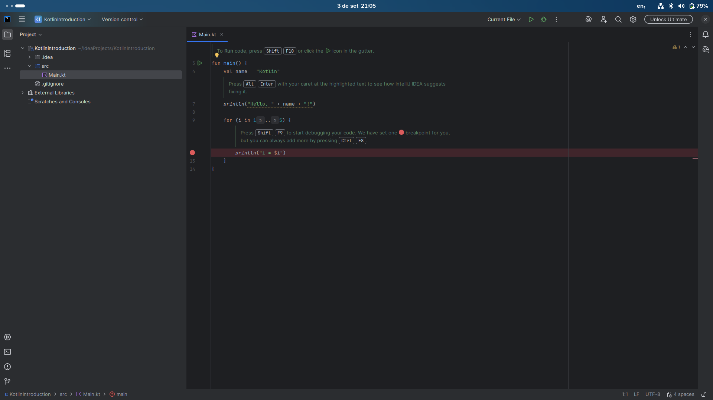
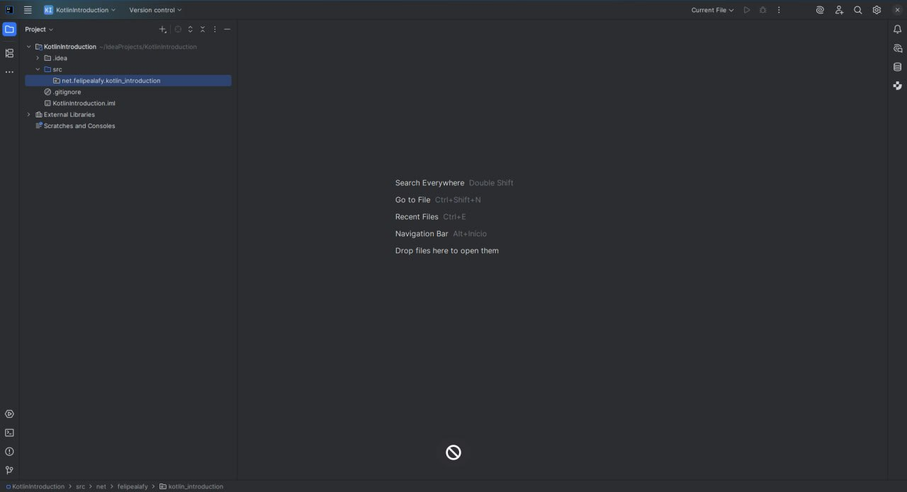
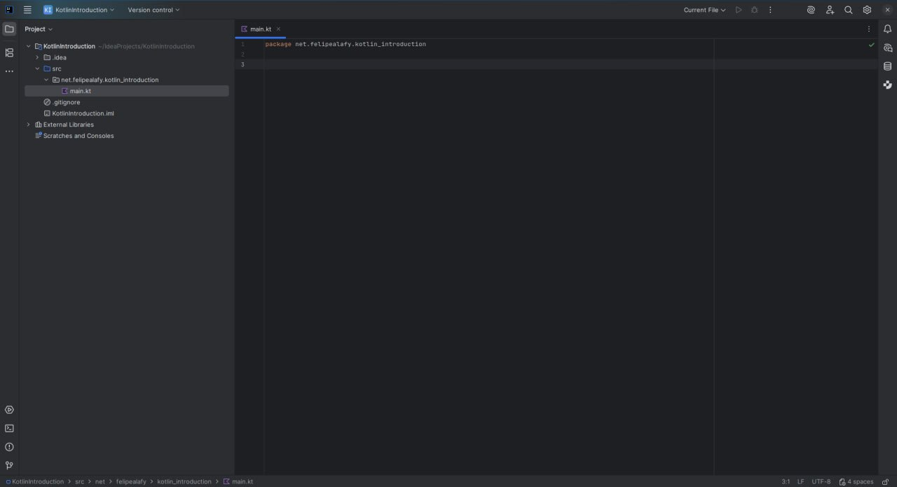

# Introdução ao Kotlin
---
## Por que usar Kotlin?
* Em 2019, o Kotlin foi considerado pelo Google como a linguagem padrão para o desenvolvimento de aplicativos Android.
* O Kotlin oferece uma sintaxe mais moderna, concisa e suporta diversos paradigmas de programação, incluindo o estruturado, o orientado a objetos e o funcional.
* O Kotlin é multiplataforma. Onde existe uma Java Virtual Machine (JVM), não apenas o Java e o Scala podem ser executados, mas também o Kotlin, pois ele pode ser compilado para o mesmo bytecode que roda na JVM.
* Mas o Kotlin não se limita a isso. Atualmente, ele é capaz de ser transpilado para JavaScript, gerar aplicativos nativos para desktop que não exigem uma JVM, rodar no backend de servidores e desenvolver aplicativos multiplataforma para Android, iOS, Desktop e Web.
---
## Nosso objetivo com este tutorial
* Neste arquivo, veremos os conceitos introdutórios do Kotlin. Veja a lista de conteúdo:
* Criando o primeiro projeto no IntelliJ IDEA;
* Exibindo texto na tela;
* Armazenando valores em variáveis e constantes;
* Pedindo para o usuário inserir um valor no terminal;
* Estruturas condicionais;
* Laços de repetição;
* Variáveis compostas (Arrays e Listas).

> [!ALERT]
> Para que você possa seguir esta trilha, é necessário ter conhecimento de Lógica de Programação. Nosso objetivo aqui não é te ensinar a programar do zero, mas sim habilitá-lo em uma nova linguagem de programação.
---
## Criando o primeiro projeto no IntelliJ IDEA
> [!NOTE]
> Siga o tutorial disponível no arquivo `0. Requisitos.md` para realizar a instalação do IntelliJ IDEA e do Android Studio.
* Abra o IntelliJ IDEA.
* Você será recepcionado pela tela de boas-vindas. Vamos começar clicando em `+ New Project`.
* Em seguida, o IntelliJ perguntará quais as configurações de projeto você gostaria de usar.
* Comece selecionando a opção `Kotlin` na aba lateral esquerda.
* Agora, vamos configurar o nome do nosso projeto para ser `KotlinIntroduction`.
* Se você quiser personalizar o local onde seu projeto será salvo, basta clicar na opção `Location` e selecionar o diretório desejado.
* Depois, clique em `Create`.

## Seu primeiro projeto em Kotlin
* Agora, você vai se deparar com seu projeto Kotlin, vamos entender como a IDE e código base de Kotlin funcionam.


* Na nossa aba lateral esquerda, temos a visão dos nossos arquivos Kotlin. Assim como em Java aqui, a estrutura de diretórios é chamada de _package_, pacote, todos os nossos arquivos de desenvolvimento ficam dentro da pasta src.
* Clicando com o botão direito dentro do src, o intellij, nós mostrará uma série de opções, como criar novo package, ou criar novo arquivo.
* Se você já teve experiências com linguagens como C, C++, Go, Rust, Etc. Você deve se lembrar que trabalhar com múltiplos arquivos é um processo no mínimo trabalhoso.
* Vamos olhar o exemplo do C, nele geralmente quando queremos trabalhar assim precisamos criar o arquivo diretamente, e então criar um _headerfile_, um cabeçalho, aquele arquivo que termina com a extensão _.h_.
* Em linguagens que rodam com base na JVM, esse processo é extremamente simples, direto e sem confusões.
* Para trabalhar com múltiplos arquivos, você precisará apenas criar um arquivo no mesmo diretório, e todas as suas funções, classes, enuns, Etc. estarão disponíveis para ser usados nos seus outros arquivos.
* Claro isso não é o ideal. Por isso, é fortemente recomendado separar seus arquivos em packages. Como disse anteriormente, uma package, atua basicamente como um diretório. Ou seja, podemos criar quantas packages quisermos, e ao mesmo tempo, uma package pode ter subpackages.
* Entretanto, o padrão a ser seguido no Java é usar o domínio reverso, ou seja se você tem um site, como o meu felipealafy.net por exemplo, agora devemos inverter esse domínio, veja:

`net.felipealafy.nome_do_projeto`

* Veja que o nome do projeto vai integrar a nossa package.
* Toda vez que você quiser criar uma subpackage, ela será adicionada automaticamente após o nome do seu projeto.
> [!Note]
> Você deve ter notado o uso do _._ no lugar das tradicionais barra / e contra barra \\, esse é mais uma característica das packages, porém, quando você abrir no seu gerenciador de arquivos, você vai reparar que é o ponto é apenas uma maneira de exibir a divisão.

* exemplo de uma subpackage chamada _database_:
`net.felipealafy.nome_do_projeto.database`



* Agora que já entendemos a navegação de arquivos vamos nos concentrar no foco principal, o editor de texto.

* Note que nas últimas versões o intellij começou a entregar um exemplo de Olá, mundo!, padrão para o kotlin dentro do arquivo _main.kt_.
* vamos começar excluindo esse arquivo main.kt, pois vamos começar do absoluto zero.
* Depois de apagar ele na navegação de arquivos, vamos fazer a construção base da nossa package. Caso você não tenha um domínio, tudo bem, você pode colocar algo como:
`com.seu_nome.kotlin_introduction`
Ou
`com.example.kotlin_introduction`
* agora clique com o botão direto em cima da package, e clique em new file, e selecione kotlin file.
* No nome você vai colocar _main.kt_
* Agora sim você tem um arquivo vazio. Ou quase isso, note que o intellij cria automaticamente, a declaração de package onde nosso arquivo está.

* Então você não precisa se preocupar com isso.
* Clique na linha 3. E vamos continuar.
## A função main:
* Se você já trabalhou com Java, C, C++, C#, entre muitas outras linguagens, sabe que existe uma função de entrada para o seu programa, chamada `main`. É o que vamos criar agora.
* Porém, antes, vamos entender o que é uma função em Kotlin.
* Toda função em Kotlin precisa ser declarada com a seguinte estrutura básica:

```Kotlin
fun nomeDaFuncao() {
    // Corpo da função
}
```

* A palavra-chave para declarar funções é `fun`.
* Dentro de um arquivo, você pode ter quantas funções quiser, em qualquer ordem.
* Se você conhece Orientação a Objetos (OO), principalmente vindo do Java, pode estar se perguntando por que a IDE não criou o clássico:
```Java
public class Main {
    public static void main(String[] args) {
        System.out.println("Olá, Mundo!");
    }
}
```
* A resposta é que, ao contrário do Java, que é fortemente focado em Orientação a Objetos, em Kotlin podemos trabalhar com múltiplos paradigmas. Nosso ponto de entrada (`entry point`) pode ser declarado de uma maneira estrutural, em um arquivo, sem a necessidade de estar dentro de uma classe:
```Kotlin
package net.felipealafy.kotlin_introduction

fun main() {
    // Código aqui
}
```
* Sim, em Kotlin é muito mais simples construir a função `main`.

## Escrevendo texto na tela
* Para escrever qualquer texto na tela em Kotlin, usaremos a função `println("texto")`.
* Em contraposição ao `System.out.println()` do Java, em Kotlin usamos apenas `println()`.
* Vamos ver como nossa função `main` ficará após escrevermos nosso primeiro "Olá, Mundo!":
```Kotlin
package net.felipealafy.kotlin_introduction

fun main() {
    println("Olá, Mundo!")
}
```
* Em Kotlin, o ponto e vírgula (`;`) no final de cada instrução é opcional e geralmente omitido.
* Vamos rodar nosso primeiro programa!
* Ao lado da sua função `main`, o IntelliJ mostrará um ícone verde de "play". Clique nele e selecione `Run 'MainKt'`. O resultado aparecerá na janela do terminal que se abrirá na parte inferior da IDE.
* Após rodar pela primeira vez, o IntelliJ salva a configuração de execução na parte superior da janela, onde você encontrará um botão de "play" e um de "debug" (que parece um inseto).

> [!NOTE]
> Não ensinarei a depurar o código neste tutorial, mas recomendo fortemente que você aprenda a usar as ferramentas de depuração do IntelliJ, especialmente quando começar a desenvolver para Android.

* Parabéns! Você criou seu primeiro programa em Kotlin.

## Tipos de Dados Básicos em Kotlin

| Tipo    | Características                                                                                               | Exemplo                                   |
|---------|---------------------------------------------------------------------------------------------------------------|-------------------------------------------|
| `String`  | Sequência de caracteres (texto), sempre entre aspas duplas `""`.                                              | `"Olá, Mundo!"`                           |
| `Int`     | Números inteiros de 32 bits, negativos e positivos.                                                           | `-10`, `20`                               |
| `Long`    | Números inteiros de 64 bits. Use quando `Int` não for suficiente. Devem ter a letra `L` no final.              | `-75000000000L`, `100L`                   |
| `Float`   | Números de ponto flutuante (reais) de 32 bits. Devem ter a letra `F` ou `f` no final.                          | `-3.14F`, `3.14f`                         |
| `Double`  | Números de ponto flutuante de 64 bits. É o tipo padrão para números com casas decimais.                       | `-3.14`, `99.99`                          |
| `Boolean` | Valores lógicos que podem ser `true` ou `false`.                                                              | `false`, `true`                           |
| `Char`    | Representa um único caractere. Deve estar entre aspas simples `''`.                                           | `'A'`, `'B'`, `'C'`                       |
| `Unit`    | Similar ao `void` em Java. Indica que uma função não retorna nenhum valor de forma explícita. É opcional.    | `fun minhaFuncao(): Unit {}`              |
| `Any`     | A superclasse de todas as classes em Kotlin. Qualquer objeto é do tipo `Any`. Similar ao `Object` em Java.      |                                           |

## Trabalhando com Constantes e Variáveis

### Constantes (`val`)
Uma constante é um valor que, uma vez atribuído, não pode ser alterado. Em Kotlin, declaramos constantes usando a palavra-chave `val`.

* **Sintaxe:** `val NOME_DA_CONSTANTE: Tipo = valor`
* A convenção para nomes de constantes (valores imutáveis que são conhecidos em tempo de compilação) é usar letras maiúsculas com `_` (SNAKE_CASE). Para valores imutáveis locais, usa-se `camelCase`.

No exemplo a seguir, vamos criar uma constante para a mensagem "Olá, Mundo!":
```Kotlin
val MENSAGEM: String = "Olá, Mundo!"`
```

Como o compilador do Kotlin possui inferência de tipo, ele consegue identificar o tipo pelo valor atribuído. Portanto, podemos simplificar:
`val mensagem = "Olá, Mundo!"`

Para usar o valor, basta chamar a constante pelo nome: `println(mensagem)`.

* **📋 Desafio:** Imprima a mensagem "Olá, Mundo!" 10 vezes na tela usando a constante que criamos.
```Kotlin
package net.felipealafy.kotlin_introduction

fun main() {
    val mensagem = "Olá, Mundo!"
    println(mensagem)
    println(mensagem)
    println(mensagem)
    println(mensagem)
    println(mensagem)
    println(mensagem)
    println(mensagem)
    println(mensagem)
    println(mensagem)
    println(mensagem)
}
```
*(Veremos uma forma muito mais eficiente de fazer isso na seção de Laços de Repetição!)*

### Variáveis (var):
Uma variável funciona como uma constante, porém seu valor pode ser reatribuído ao longo do programa. Para declarar, usamos a palavra-chave `var`.

* **Sintaxe:** `var nomeDaVariavel = valorInicial`
```Kotlin
package net.felipealafy.kotlin_introduction

fun main() {
    var numero = 0
    println(numero) // Saída: 0

    numero = 10
    println(numero) // Saída: 10
}
```

## Lendo a entrada do usuário
Para pedir que o usuário digite um valor no terminal, usamos a função `readln()`:
`val entradaDoUsuario = readln()`

Note que `readln()` sempre retorna uma `String`. Se precisarmos de outro tipo, devemos realizar a conversão:
```Kotlin
val idade = readln().toInt()       // Converte para Int
val peso = readln().toFloat()     // Converte para Float
val altura = readln().toDouble()  // Converte para Double
```

* **Exemplo prático:** um programa que recebe dois números do usuário.
```Kotlin
package net.felipealafy.kotlin_introduction

fun main() {
    print("Digite um número: ")
    val a = readln().toInt()
    print("Digite outro número: ")
    val b = readln().toInt()
    println("Os números digitados foram $a e $b")
}
```

## Operadores Matemáticos

| Operador | Função                      | Exemplo       | Atribuição Composta |
|----------|-----------------------------|---------------|---------------------|
| `+`      | Soma                        | `2 + 2`       | `soma += 2`         |
| `-`      | Subtração                   | `5 - 1`       | `sub -= 1`          |
| `*`      | Multiplicação               | `2 * 3`       | `res *= 3`          |
| `/`      | Divisão                     | `10 / 2`      | `res /= 2`          |
| `%`      | Módulo (resto da divisão)   | `10 % 3`      | `res %= 2`          |

* **Exemplo de um programa de soma:**
```Kotlin
package net.felipealafy.kotlin_introduction

fun main() {
    // A diferença entre print e println é que print não adiciona uma nova linha no final.
    print("Digite o primeiro número: ")
    val n1 = readln().toInt()
    print("Digite o segundo número: ")
    val n2 = readln().toInt()

    val soma = n1 + n2
    println("A soma entre $n1 e $n2 é igual a $soma")
}
```
* Note que o Kotlin respeita a ordem de precedência da matemática (primeiro multiplicação/divisão, depois soma/subtração).

---
## Template Strings
Se você vem de linguagens como Java ou C, está acostumado com funções como `printf` para formatar strings.

printf("A soma entre %d e %d é igual a %d", n1, n2, (n1 + n2));

O Kotlin apresenta uma maneira mais moderna e legível de lidar com isso: **Template Strings**. Podemos embutir variáveis e expressões diretamente dentro de uma String usando o símbolo `$`.

* Para uma variável simples, use `$nomeDaVariavel`.
* Para expressões ou chamadas de função, use `${expressao}`.

Veja como o exemplo da soma fica mais limpo:
```Kotlin
package net.felipealafy.kotlin_introduction

fun main() {
    val n1 = 10
    val n2 = 20
    println("A soma entre $n1 e $n2 é igual a ${n1 + n2}")
}
```

---
## Estruturas Condicionais
Condicionais nos permitem executar blocos de código apenas se uma determinada condição for verdadeira. Para isso, usamos expressões booleanas.

**Operadores Lógicos e de Comparação**

| Operação           | Operador | Exemplo                     |
|--------------------|----------|-----------------------------|
| Igual a            | `==`     | `5 == 5` (true)             |
| Diferente de       | `!=`     | `5 != 4` (true)             |
| Maior que          | `>`      | `5 > 3` (true)              |
| Maior ou igual a   | `>=`     | `5 >= 5` (true)             |
| Menor que          | `<`      | `5 < 6` (true)              |
| Menor ou igual a   | `<=`     | `5 <= 5` (true)             |
| E (Conjunção)      | `&&`     | `(5 > 3) && (2 < 3)` (true) |
| OU (Disjunção)     | `\|\|`     | `(5 > 6) \|\| (3 > 2)` (true) |
| Negação            | `!`      | `!false` (true)             |

### As estruturas `if`, `else if`, `else`:
* `if`: Executa o bloco de código se a condição for verdadeira.
* `else`: Executa o bloco de código se a condição do `if` for falsa.
* `else if`: Permite testar múltiplas condições em sequência.
```Kotlin
package net.felipealafy.kotlin_introduction

fun main() {
    print("Digite um número entre 1 e 3 >> ")
    val controle = readln().toInt()

    if (controle == 1) {
        println("Painel do administrador.")
    } else if (controle == 2) {
        println("Painel de back-office.")
    } else if (controle == 3) {
        println("Painel do cliente.")
    } else {
        println("Opção de acesso não encontrada.")
    }
}
```

* **Nota:** Existe também a estrutura `when` em Kotlin, que é uma alternativa poderosa ao `if-else if-else` e será abordada em tutoriais mais avançados.

## Coleções: Arrays e Listas
Arrays e Listas são estruturas que nos permitem armazenar múltiplos valores em uma única variável.

### Arrays (`Array`)
Arrays em Kotlin têm um tamanho fixo. Uma vez criados, você não pode adicionar ou remover elementos.
```Kotlin
package net.felipealfy.kotlin_introduction

fun main() {
    // Criando um array de inteiros com tamanho 5
    val numeros: Array<Int> = arrayOf(1, 2, 3, 4, 5)

    // Acessando um elemento pelo índice
    // Índices começam em 0
    println("O primeiro elemento é: ${numeros[0]}") // Saída: 1
    println("O terceiro elemento é: ${numeros[2]}") // Saída: 3

    // Modificando um elemento
    numeros[0] = 10
    println("O primeiro elemento agora é: ${numeros[0]}") // Saída: 10
}
```

### Listas (`List` e `MutableList`)
Listas são mais flexíveis. Em Kotlin, temos dois tipos principais:
* `List`: Uma lista imutável (somente leitura). Depois de criada, você não pode adicionar ou remover elementos.
* `MutableList`: Uma lista mutável, onde você pode adicionar, remover e modificar elementos.
```Kotlin
package net.felipealafy.kotlin_introduction

fun main() {
    // Lista imutável (somente leitura)
    val nomesImutaveis: List<String> = listOf("Ana", "Bruno", "Carlos")
    println("Primeiro nome: ${nomesImutaveis[0]}")
    // nomesImutaveis.add("Daniela") // Isso geraria um erro de compilação

    // Lista mutável (ArrayList é uma implementação comum de MutableList)
    val nomesMutaveis: MutableList<String> = mutableListOf("Felipe", "Maria")

    // Adicionando um elemento
    nomesMutaveis.add("João")

    // Removendo um elemento
    nomesMutaveis.remove("Maria")

    println(nomesMutaveis) // Saída: [Felipe, João]
}
```

### Matrizes (Array de Arrays)
Para criar uma matriz, basta criar um array cujos elementos são outros arrays.
```Kotlin
package net.felipealafy.kotlin_introduction

fun main() {
    val linha1 = arrayOf(1, 2, 3)
    val linha2 = arrayOf(4, 5, 6)
    val linha3 = arrayOf(7, 8, 9)

    val matriz = arrayOf(linha1, linha2, linha3)

    // Acessando o elemento na linha 0, coluna 2
    println(matriz[0][2]) // Saída: 3
}
```
---
## Laços de Repetição (`for`)
Laços nos permitem executar um bloco de código repetidamente. O laço `for` é o mais comum em Kotlin.

### Iterando sobre um Intervalo (`range`)
* `..`: Cria um intervalo inclusivo. `1..5` inclui os números 1, 2, 3, 4, 5.
* `step`: Define o tamanho do "passo" da iteração.
* `downTo`: Cria um intervalo decrescente.
```Kotlin
package net.felipealafy.kotlin_introduction

fun main() {
    // De 1 a 10, de 1 em 1
    println("Contando de 1 a 10:")
    for (i in 1..10) {
        print("$i ") // Saída: 1 2 3 4 5 6 7 8 9 10
    }
    println()

    // De 1 a 10, de 2 em 2
    println("\nContando de 1 a 10 com passo 2:")
    for (i in 1..10 step 2) {
        print("$i ") // Saída: 1 3 5 7 9
    }
    println()

    // De 10 a 1
    println("\nContagem regressiva de 10 a 1:")
    for (i in 10 downTo 1) {
        print("$i ") // Saída: 10 9 8 7 6 5 4 3 2 1
    }
    println()
}
```

### Iterando sobre Coleções
A principal aplicação de laços é percorrer os elementos de uma coleção (array ou lista).

**Usando `for-in` (a forma mais comum):**
```Kotlin
package net.felipealafy.kotlin_introduction

fun main() {
    val frutas = listOf("Maçã", "Banana", "Laranja")
    for (fruta in frutas) {
        println(fruta)
    }
}
```

**Usando `.forEach`:**
As coleções em Kotlin possuem uma função chamada `forEach` que simplifica a iteração.
```Kotlin
package net.felipealafy.kotlin_introduction

fun main() {
    val numeros = arrayOf(10, 20, 30)
    numeros.forEach { numero ->
        println("O número é $numero")
    }

    // Se a lambda tem apenas um parâmetro, podemos usar o nome padrão "it"
    numeros.forEach {
        println("Usando 'it': $it")
    }
}
```

**Iterando sobre uma Matriz:**
Podemos aninhar laços para percorrer uma matriz.
```Kotlin
package net.felipealafy.kotlin_introduction

fun main() {
    val matriz = arrayOf(
        arrayOf(1, 2, 3),
        arrayOf(4, 5, 6),
        arrayOf(7, 8, 9)
    )

    matriz.forEach { linha ->
        linha.forEach { coluna ->
            print("$coluna ")
        }
        println() // Pula para a próxima linha após imprimir cada linha da matriz
    }
}
```
---
# Finalização
* Obrigado por ler e aprender com este material. Espero que tenha sido útil para você.
* No próximo material, aprenderemos como escrever funções de maneira mais avançada e como organizar nosso código em múltiplos arquivos.